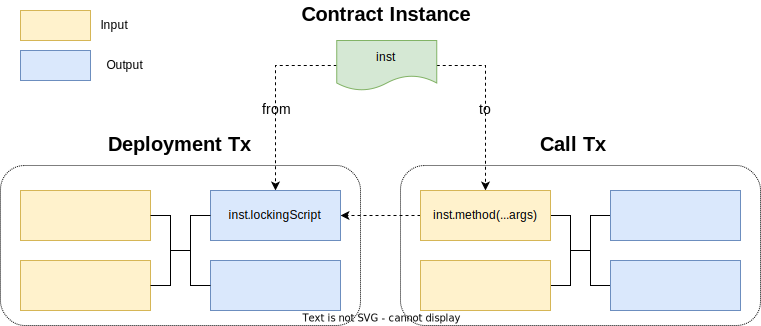

# How to Deploy & Call a Contract

## Concepts

To simplify and better understand how smart contract works, we shall clarify some basic concepts first. 

### Contract Deployment

We can define a contract deployment as this procedure:

Assume we’re building a new tx as a normal [P2PKH](https://learnmeabitcoin.com/technical/p2pkh) transaction. The only difference here is we add an output that contains the locking script generated by a contract instance. 

If the new tx is broadcast and accepted by miners, we say it’s a successful deployment for the contract and the instance is called a contract genesis instance.

### Contract Call

We can define a contract call as this procedure:

Assume we have an UTXO that contains the locking script from a certain contract instance, which we can name as `prevInstance`. 

Now we’re building a new tx to spend this UTXO in one of its inputs, and we need to prepare the corresponding unlocking script for this UTXO. The unlocking script is actually composed of the arguments passed for calling `prevInstance.entryMethod`. 

Meanwhile, we may also add an output that contains the locking script generated by an instance, which we name as `curInstance`, of the same contract.

So if the new tx is broadcast and accepted by miners, we say it’s a successful call from the `prevInstance`. And if `curInstance` exists, we say the up-to-date or the latest instance of contract is also changing from the `prevInstance` to the `curInstance`.

Keep in mind that the latest or up-to-date instance of a contract always has exactly the same locking script with its current UTXO.




## Steps

Generally speaking, if you want to deploy or call the contract to BSV network, it takes three steps:

### 1. Build a contract instance

Giving proper parameters to get an up-to-date contract instance, like:

```ts
let instance = new MyContract(...args);
```

### 2. Build a tx

Build a tx corresponding to your business logic, especially to set the tx's proper input & output script with contract instance.

Conceptually speaking, a contract instance has two kinds of relation with txs:

#### The `lockTo` Relation

A contract `instance` has a `lockTo` relation with a `tx` means that the `instance` forms the locking script in one of the `tx`'s outputs.

From the perspective of `tx`, it may look like this:

```js
tx.addOutput(new bsv.Transaction.Output({
  script: instance.lockingScript,
  ...
}))
```

From the perspective of `instance`, the binding can be declared like:

```js
instance.lockTo = { tx, outputIndex: 0 };
```

#### The `unlockFrom` Relation

A contract `prevInstance` has a `unlockFrom` relation with a `tx` means that a call to `prevInstance`'s public(entry) `@method` will form the unlocking script in one of the `tx` inputs.

From the perspective of `tx`, it may look like this:

```js
tx.addInput(new bsv.Transaction.Input({
  script: prevInstance.getUnlockingScript( inst => inst.customEntryMethod(...args) )
  ...
}))
```

From the perspective of `prevInstance`, the binding can be declared like:

```js
prevInstance.unlockFrom = { tx, inputIndex: 0};
```

### 3. Send the tx

The final step is to sign and send the tx to the network. If everything is fine, the tx will be accepted by miners.

## Example

Here is a complete example code to deploy & call the `Demo` contract.

```js
// compile contract to get low-level asm
await Demo.compile();

// build contract instance
const demo = new Demo(2n);
const balance = 1000;

// build contract deploy tx
const utxos = await fetchUtxos();
const unsignedDeployTx =
  new bsv.Transaction()
    .from(utxos)
    .addOutput(new bsv.Transaction.Output({
      // get the locking script for `demo` instance
      script: demo.lockingScript, 
      satoshis: balance,
    }));

// send contract deploy tx
const deployTx = await signAndSend(unsignedDeployTx);
console.log('contract deployed: ', deployTx.id)

// build contract call tx
const unsignedCallTx =
  new bsv.Transaction()
    .addInput(new bsv.Transaction.Input({
      prevTxId: deployTx.id,
      outputIndex: outputIdx,
      script: demo.getUnlockingScript(() => {
        // call public method to get the unlocking script for `demo` instance.
        demo.unlock(3n);
      }),
      output: deployTx.outputs[outputIdx]
    }))
    .addOutput(
      new bsv.Transaction.Output({
        script: bsv.Script.buildPublicKeyHashOut(publicKey.toAddress()),
        satoshis: balance / 2
      })
    );

// send contract call tx
const callTx = await signAndSend(unsignedCallTx);
console.log('contract called: ', callTx.id)
```


